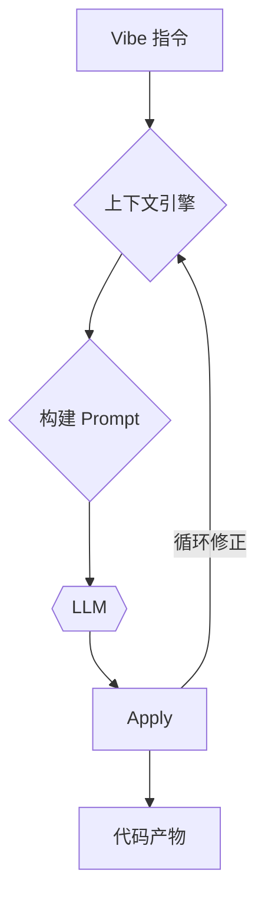

<GlowBackground>
  <h1 class="text-6xl md:text-8xl font-bold tracking-tight text-white">
    深入Cursor协作
     
    理解并驾驭VibeCoding幻觉
  </h1>
</GlowBackground>

---
layout: default
---

# “Vibe Coding” 的兴起

我们正在进入一个新的编程时代：

- **传统编程**: 我们告诉计算机**如何做**每一步。
- **Vibe Coding**: 我们告诉 AI 我们**想要什么**，基于一种“感觉”或“意图”(Vibe)。

但这种模式有一个必然的阴影...

---
layout: default
---

# 代码幻觉 (Code Hallucination)

AI 生成了**语法正确、看似合理，但实际上无法按预期工作**或不满足真实需求的代码。

 

> 幻觉不是 Bug，而是 AI 概率模型的固有产物。

我们的目标不是创造一个“完美”的 AI，而是希望在工程应用中，让ai尽可能减少出错，按照我们的目标逐步前进。

---
layout: section
---

# Part 1: 幻觉的数学根源
## The Mathematical Roots of Hallucination

---
layout: default
---

# 核心概念：熵 (Entropy) = 不确定性

AI 的核心是基于概率预测下一个词。**熵**，就衡量了它在预测时的“困惑”程度。
$$ H_{\text{token}}(P) = - \sum_{i=1}^{V} p_i \log_2 p_i $$

### 低熵状态 (Low Entropy)
模型非常**确定**。
- **指令**: `import numpy as`
- **输出**: `np` (概率极高)
- **结果**: 预测准确，符合项目上下文。

### 高熵状态 (High Entropy)
模型非常**困惑**。
- **指令**: “帮我处理用户数据”
- **输出**: `read`? `write`? (概率分散)
- **结果**: 风险极高，容易产生**Token 级幻觉**。

> **高熵状态** 是滋生幻觉的温床。

---
layout: default
---

# 幻觉的雪崩：级联模型

一个微小的初始幻觉（如用错一个词），会如何演变成一场代码灾难？
这就是 **幻觉级联 (Cascading Hallucination)** 或 **误差传播 (Error Propagation)**。

1.  **初始幻觉**: 在高熵状态下，模型选错了一个 Token。
2.  **上下文污染**: 这个错误的 Token “污染”了后续的上下文。
3.  **熵值飙升**: 模型为了“合理化”最初的错误，进入更高的熵状态，做出更多错误决策。
4.  **链式不忠**: AI 会顽固地“忠于”这个错误，越陷越深，最终导致代码产物完全偏离目标。

> 这个过程就像雪崩，一个初始的小错误，会沿着决策链不断放大。

---
layout: default
---

# 微观模型(1): Token级幻觉

幻觉的根源，在于模型生成**单个Token**的瞬间。

- **正确Token集 (T_correct)**: 在给定的项目上下文中，逻辑上“合理”的下一批Token。
  - e.g., 在 `user_service.` 后，`T_correct` 应包含该 service 的真实方法名。

- **Token级幻觉 (H_token)**: 模型生成了一个**不属于** `T_correct` 的Token。

其概率由当前上下文 `C` 决定：
$$ P(H_{\text{token}} | C) = \sum_{t_h \notin T_{\text{correct}}} P(t_h | C) $$

---
layout: default
---

# 微观模型(2): 误差传播与级联

一个Token的幻觉，会污染下一步的上下文，引发雪崩。

1.  **初始污染**: 模型产生第一个幻觉Token `g` (本应是 `f`)。
2.  **上下文被污染**: 新的上下文变为 `C' = C + "g"`。
3.  **“忠于”错误**: 在 `C'` 的基础上，模型会更倾向于补全它熟悉的 `get...` 而非项目中的 `fetch...`，概率被放大。
4.  **任务级幻觉**: 最终生成一个完整的幻觉函数名 `getAllUsers()`。

 

> 这就是**误差传播**的数学体现。一个高熵的初始状态，启动了这条错误的链条，后续的每一步都在放大这个错误，最终导致任务级的幻觉。

---
layout: section
---

# Part 2: 驾驭级联
## Vibe 指令与作为“熵压缩器”的 AI Agent

---
layout: default
---

# Vibe Coding: 级联的“第一推动力”

**Vibe Coding**（如“帮我处理一下用户数据”）的本质，就是为 AI 的概率决策链提供了**一个极高熵的初始状态**。

- 它迫使 AI 依赖其训练数据中的**通用模式**，而不是你项目的**特定需求**。
- 这几乎必然会导致**第一个 Token 级幻觉**的产生，从而启动整个幻觉级联。

 

**我们如何对抗这种与生俱来的熵增？**

---
layout: default
---

# AI Agent: 上下文熵压缩器

Cursor，其核心价值之一就是作为**上下文熵压缩器 (Contextual Entropy Reducer)**。
它在开发者和 LLM 之间，系统性地降低初始熵，抑制级联的发生。

整个 Agent 工作流的成功，依赖于链条上**每一步**的成功概率。

$$ P(\text{Success}) = P(S_4|S_3) \cdot P(S_3|S_2) \cdot P(S_2|S_1) \cdot P(S_1|A) $$

一个高熵的初始指令 `A`，会从源头上降低第一步 `P(S1|A)` 的成功率，从而危及整个任务。

> AI Agent 的“智能”，在于它是一个出色的**上下文工程师**，在幻觉发生前就介入。

---
layout: default
---

# 影响级联的三大变量

除了清晰的指令，还有三个核心变量在时刻影响着幻觉的概率。

### 1. 提示词特性
**初始熵源**
- **Vibe 指令**: 注入极高的初始熵，启动级联。
- **精确指令**: 提供低熵的起点，抑制级联。

### 2. AI 模型特性
**处理器**
- **强模型 (Gemini 2.5 Pro)**: 内在条件熵更低，处理不确定性的能力更强。
- **弱模型**: 更容易在模糊的上下文中产生幻觉。

### 3. 编程语言特性
**约束器**
- **强类型 (TypeScript, Rust)**: 提供强烈的、低熵的负反馈（编译错误），有效“惩罚”幻觉。
- **弱类型 (JavaScript)**: 为 AI 提供了更大的“幻觉空间”。

---
layout: section
---

# Part 3: Cursor的上下文的工程挑战
## 在有限空间内寻求无限知识

---
layout: default
---

# 上下文悖论 (The Context Paradox)

> 一个大型项目的知识总量可能是**百万级**的 tokens，而 LLM 的记忆窗口只有 **32k 到 128k**。

**我们如何将一个“无限”的知识空间，塞进一个“有限”的记忆窗口里？**

 

Cursor的核心价值之一，正在于它是一个精密的 **客户端上下文引擎 (Client-Side Context Engine)**。

---
layout: default
---

# Cursor 的上下文管理策略

### 主动索引与摘要
- **做法**: 遍历项目，为每个函数、类生成摘要或向量嵌入 (Embeddings)。
- **价值**: 无需发送完整代码，用高信息密度的“名片”让 AI 快速理解功能。

### 意图驱动的即时检索 (RAG)
- **做法**: 分析指令，在索引库中查找最相关的代码片段。
- **价值**: 精准“捞出”最相关的代码注入上下文，极大降低无关信息的干扰。

### 动态压缩与选择性遗忘
- **做法**: 总结旧对话，丢弃与当前任务最不相关的上下文。
- **价值**: 确保宝贵的上下文窗口，总是被当下最关键的信息占据。

---
layout: default
---

# 执行的最后一公里风险

我们还必须注意 Agent 执行修改的最后环节：`apply` 工具。

- **它也是 AI**: 这个工具由一个更小、更快的 AI 子模型驱动，用来执行主模型生成的“修复指令”。

 

- **模糊定位问题 (Ambiguous Location Problem)**
  - 如果目标文件非常庞大且复杂，子模型在接收到指令时可能会“犯糊涂”。
  - 它可能在文件中发现多个看似都符合指令的修改位置，并**随机选择一个**，导致代码被错误地应用在非预期的位置。

> **这为“拆分文件”和“模块化重构”提供了另一个至关重要的理由**：一个职责单一、行数较少的文件，会极大地降低 `apply` 子模型产生定位错误的概率。

---
layout: section
---

# Part 4: 人类的解决方案
## 从“架构对话”到“模型切换”

---
layout: default
---
# 最佳策略：用清晰的架构为 AI “降熵”

一个清晰、模块化的项目架构，是你能给 AI 提供的最有效、最根本的上下文。

> 在动手编码前，先与 AI 对话，**用它帮你生成和组织一个清晰的架构**，是最高级的 AI 协作技巧。亦或者你有很棒的构架能力，自己设计一套合理的框架。

---
layout: default
---

# 工作流：引导式生成 (Guided Generation)

**目标**：化被动为主动，在过程中持续引导，而非事后修复。

1.  **初始生成 (Initial Scaffolding)**
    - 让 AI 完成从 0 到 1 的工作，生成基础脚手架。
    - *“帮我创建一个用户列表屏幕”*

2.  **观察并立即干预 (Observe & Intervene)**
    - 得到初步结果后，立即审查，塑造半成品。

3.  **分步架构指令 (Step-by-step Guidance)**
    - 发出精确、模块化的指令，逐步引导代码成型。
    - *“很好，现在把业务逻辑移到 ViewModel”*
    - *“再把这个 UI 拆分成可复用的组件”*

> 这种**小步快跑**的方式，将 AI 的创造力限制在可控范围内。

---
layout: default
---
# 终极武器：将模型本身作为“工具”

不同的 LLM 如同性格各异的程序员，要懂得在合适的任务中切换。

### Claude 系列
**“急先锋”**
- **擅长**: 项目初始化、文件操作、修复幻觉类错误。
- **弱点**: 算法黑洞，可能会“伪造”输出来糊弄人。

### Gemini
**“算法专家”**
- **擅长**: 深度思考，解决复杂算法难题。
- **弱点**: 响应慢，有时也会有自己的幻觉。

### GPT-4.1
**“瑞士军刀”**
- **擅长**: 快、狠、准地执行明确指令。
- **弱点**: 相对缺乏深度思考的创造性火花。

---
layout: default
---

# 其他高效武器

 

- **单元测试驱动 (Unit Test Driven)**
  - 为 AI 提供最直接、最低熵的反馈（“修复代码，直到测试通过”）。
  - **警惕**：AI 连续失败后可能“越修越坏”，甚至去修改测试用例本身。

 

- **日志驱动 (Log Driven)**
  - 让 AI 在关键路径加日志，将其“黑箱”思考过程暴露出来。

 

- **范例驱动 (Example Driven)**
  - “请参考 `ExistingModule` 的实现方式，来重构 `BrokenModule`。”
  - 这是约束 AI 行为、保证项目一致性的最强“镣铐”。

---
layout: section
---
# 最终的图景：开发者的进化

---
layout: default
---

# 商业项目的红线

将 AI 用于真实商业项目时，除了幻觉，还有两条不可逾越的红线：

- **代码隐私**
  - 必须明确代码数据的使用边界。幸运的是，Cursor 提供了严格的隐私模式，承诺不使用用户代码进行模型训练。

- **意图审查 > 代码审查**
  - AI 的漏洞，往往不是它“有意”写下的，而是源于我们模糊的指令被它用一种**功能正确、但安全上有隐患**的方式实现了。
  - 审查 AI 代码时，我们不仅要看代码“做什么”，更要思考它是否“安全地”实现了我们的“真实意图”。

---
layout: default
---

# 你的知识水平，决定了 AI 的上限

AI 拥有无与伦比的**广度**，但缺乏对项目深层逻辑和架构的**深度**。

在 AI 时代，我们工程师的核心价值，正在从“精通语法”转向更高维度的能力：
- **通用的面向对象与设计模式思维**
- **产品与架构思维**
- **开发流程思维**

> 我们不再只是 AI 的“使用者”，而是它的“**引导者**”。

---
layout: cover
class: bg-[#0F0F0F] text-white text-center
---

<GlowBackground>
  <h1 class="text-5xl font-bold">我们，依然是代码世界的主人。</h1>
  
通过驾驭 AI，我们的能力得到了前所未有的延伸。

   
   
  
Q & A

</GlowBackground> 